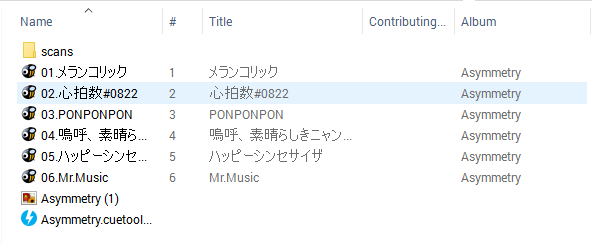
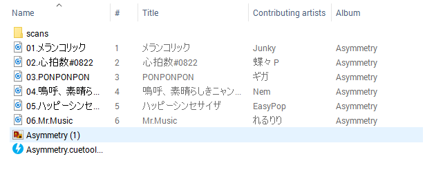

# FlacConverterNodeJS
Convert Flac files to mp3

##  GIỚI THIỆU
-----------------

- Bài sẽ hướng dẫn Sử dụng NodeJS để code chương trình chuyển đổi file nhạc lossless .flac sang file .mp3 theo từng bước cơ bản.
- Chuyển định dạng file flac trong thư mục đầu vào và in ra thư mục đầu ra theo đúng cấu trúc và chỉ chuyển file flac sang mp3,
còn các file khác giữ nguyên.
- Chuyển định dạng file flac đơn sang một file mp3.
- Các thư viện phụ trợ:
    - ffmpeg dùng để chuyển đổi dạng file.
    - child-process để chạy terminal đổi dạng file thông qua ffmpeg
    - read-chunk và file-type để đọc định dạng file (.flac) để tránh các file 'trap' như text nhưng đuôi flac.
- Kết quả có được sau khi convert:

  
  

- p/s: dùng window chạy cái này là không nên....

## SỬ DỤNG
-------------
- Bạn phải cài đặt ffmpeg trên máy để có thể convert được.

- Install node_modules:
  ```
  npm install 
  ``` 
- Chạy file index.js để convert folder chứa file flac:
  ```
  node index.js Folder "your-bitrate" "your-input-folder" "your-output-folder"

  --or--

  node index.js Folder "128k" "Desktop/Test Flac Folder" "Desktop/Orther Folder"
  ```
- Hoặc convert 1 file:
  ```
  node index.js File "your-bitrate" "flac-file-path" "mp3-file-path"

  --or--

  node index.js File "320k" "Desktop/Flac/Asymmetry/03.PONPONPON.flac" "Desktop/03.PONPONPON.mp3"
  ```

- Chú ý: 
	- Bitrate là tham số quyết định chất lượng của file mp3,vd như 128k, 160k, 320k, ...
	- Nên cho input và output và dấu ngoặc kép " " để tránh dấu space trên terminal.

## THƯ VIỆN
----------
#### ffmpeg: 

- Cài đặt:   [FFMPEG](https://ffmpeg.org/)

- FFmpeg là một thư viện có rất nhiều tiện ích cho việc xử lý video và audio. Tính năng nổi bật nhất có lẽ là khả năng 
encode/decode nhiều video,audio có format khác nhau, giúp convert qua lại nhiều định dạng video,audio. Ngoài ra, chúng 
ta cũng có thể dùng FFmpeg để cắt một đoạn video, crop video, chụp lại các frame và xuất ra dạng hình ảnh,...

- Sau khi cài đặt ffmpeg và gõ ffmpeg -version thì ta sẽ thấy thông tin của nó trên terminal: 

  ```
  $ ffmpeg -version
  ffmpeg version N-86330-gbd1179e Copyright (c) 2000-2017 the FFmpeg developers
  built with gcc 7.1.0 (GCC)
  configuration: --enable-gpl --enable-version3 --enable-cuda --enable-cuvid --enable-d3d11va --enable-dxva2 --enable-libmfx --enable-nvenc 
  --enable-avisynth --enable-bzlib --enable-fontconfig --enable-frei0r --enable-gnutls --enable-iconv --enable-libass --enable-libbluray 
  --enable-libbs2b --enable-libcaca --enable-libfreetype --enable-libgme --enable-libgsm --enable-libilbc --enable-libmodplug 
  --enable-libmp3lame --enable-libopencore-amrnb --enable-libopencore-amrwb --enable-libopenh264 --enable-libopenjpeg --enable-libopus 
  --enable-librtmp --enable-libsnappy --enable-libsoxr --enable-libspeex --enable-libtheora --enable-libtwolame --enable-libvidstab 
  --enable-libvo-amrwbenc --enable-libvorbis --enable-libvpx --enable-libwavpack --enable-libwebp --enable-libx264 --enable-libx265 
  --enable-libxavs --enable-libxvid --enable-libzimg --enable-lzma --enable-zlib

  libavutil      55. 63.100 / 55. 63.100
  libavcodec     57. 96.101 / 57. 96.101
  libavformat    57. 72.101 / 57. 72.101
  libavdevice    57.  7.100 / 57.  7.100
  libavfilter     6. 90.100 /  6. 90.100
  libswscale      4.  7.101 /  4.  7.101
  libswresample   2.  8.100 /  2.  8.100
  libpostproc    54.  6.100 / 54.  6.100
  ```
- Cú pháp để convert file flac sang mp3 trong đó giữ nguyên megadata làm giảm dung lượng file nhưng vẫn giữ được chất lượng âm thanh,
trong đó ```-y``` để overwrite các file trùng tên có sẵn, ```320k``` có thể đổi thành ``160k``, ```128k```,...
  ```
  ffmpeg -y -i <input.flac> -ab 320k -map_metadata 0 -id3v2_version 3 <output.mp3>
  ```
- Trong bài ta sẽ dùng vòng lặp để lặp lại cú pháp trên và convert từng file một.

#### Read-chunk và File-type:

- Cài đặt: 
  ```
  npm install file-type --save
  ```

- File-type và Read-chunk là một module của NodeJS được viết bởi [sindresorhus](https://github.com/sindresorhus/file-type). Trong khi Read-chunk sẽ đọc và trả về một chuỗi các Magic Number (vốn quyết định định dạng - format của file) còn File-type sẽ dịch chuỗi đó và trả về một đối tượng chứa thông tin của file đó.

- Ví dụ:
  ```javascript
  const readChunk = require('read-chunk');
  const fileType = require('file-type');
  const buffer = readChunk.sync('./test/Asymmetry/03.PONPONPON.flac', 0, 4100);
  
  console.log(fileType(buffer));
  //=> { ext: 'flac', mime: 'audio/x-flac' }
  ```
- Tại sao ta không dùng `path.ext(targetFile) === '.flac'` của module có sẵn `path` mà lại phải install cái module này làm gì ?, đơn giản vì path.ext sẽ trả về **bất cứ** file nào có đuôi .flac còn file-type sẽ giúp ta **lọc** được file .flac thật sự nhằm tránh các file ~~trap~~ như text.flac etc...

#### Child-process:

- Child process có nghĩa là một tiến trình con, quá trình con. Trong NodeJS nó sẽ tạo ra một child-process chạy terminal trong lúc chạy chương trình bằng terminal. Trong DOS và UNIX, Các stdout và stderr là các pipe, một ký hiệu báo cho hệ điều hành biết để gửi kết quả lối ra của một lệnh cho một lệnh khác, chứ không hiển thị lên màn hình, thế nên ta phải console.log chúng ra.

- child-process.spawn() và child-process.exec() đều là một phương thức của child process để khởi tạo một quá trình con chạy trong terminal. Điểm khác nhau duy nhất của cả hai là spawn() sẽ tạo ra một quá trình con một cách không đồng bộ, không chặn các vòng lặp sự kiện (event loops) của NodeJS, còn exec() sẽ tạo ra một shell và dùng shell đó để chạy terminal. 

  ```javascript
  const spawn = require('child_process').exec;
  const ls = exec('ls -lh /usr');

  ls.stdout.on('data', (data) => {
    console.log(`stdout: ${data}`);
  });

  ls.stderr.on('data', (data) => {
    console.log(`stderr: ${data}`);
  });

  ls.on('close', (code) => {
    console.log(`child process exited with code ${code}`);
  });

  ```

- Đoạn code trên tương đương với dòng terminal sau và kết quả trả về của nó:  
    >`$ ls -lh /usr`  

    >   total 88K  
        drwxr-xr-x 1 admin 197121 0 Apr 18 11:06 bin/  
        drwxr-xr-x 1 admin 197121 0 Apr 18 11:06 lib/  
        drwxr-xr-x 1 admin 197121 0 Apr 18 11:06 libexec/  
        drwxr-xr-x 1 admin 197121 0 Apr 18 11:06 share/  
        drwxr-xr-x 1 admin 197121 0 Apr 18 11:06 ssl/  

- Để có thể chạy ffmpeg thông qua terminal lúc đang chạy NodeJS, ta sẽ dùng child-process để chạy đoạn code chuyển đổi như đã nói trên.

  ```javascript
      const ffmpeg = exec.('ffmpeg -y -i ${input.flac} -ab 320k -map_metadata 0 -id3v2_version 3 ${output.mp3}')
  ```

- Vì Command line của Window khác so với UNIX nên bạn phải chỉnh lại cho phù hợp với hệ điều hành của bạn (vd như copy của Win và cp của UNIX).

#### Caporal:

- Cài đặt: 
  
  ```
  npm install caporal --save
  ```
- Caporal là một framework để xây dựng một ứng dụng chạy trên terminal (cpi - command line applications) bằng NodeJS, giúp khởi tạo, tô màu input, dễ dàng sử dụng,... Trong bài này caporal sẽ giúp ta truyền tham số trên terminal để chạy chương trình một cách linh hoạt.

- Ví dụ và -h,--help
  ```javascript
  const prog = require('caporal');
  prog
    .version('1.0.0') // phiên bản hiện tại của chương trình
    //lệnh để chạy chương trình.
    .command('deploy', 'Our deploy command')
    // 'app' và 'env' là tham số bắt buộc, cả hai là thuộc tính của arguments
    // và other-env là tham số không bắt buộc, tất cả các tham số này là 1 thuộc tính.
    .argument('<app>', 'App to deploy')
    .argument('<env>', 'Environment')
    .argument('[other-env...]', 'Other environments') 
    //action() để chạy chương trình
    .action(function(args, options) {
      console.log(args);
      // {
      //   "app": "myapp", 
      //   "env": "production",
      //   "otherEnv": ["google", "azure"]
      // }
    });

  prog.parse(process.argv);

  //node ./myprog.js deploy myapp production aws google azure
  ```


## PHẦN I: LOGIC

--------

### Phân tích bài toán: 

- Chương trình cho phép nhập đầu vào một thư mục chứa file flac và các file khác, đầu ra sẽ là một thư mục mới giống hệt thư mục cũ nhưng chỉ thay file flac bằng file mp3 và giữ nguyên cấu trúc thư mục và file khác. Ta sẽ có những điều sau :

- Sử dụng File System và Path để phân tích cấu trúc input folder và đẩy ra 3 mảng chứa thông tin input của thư mục (directories), các file và các file flac.

	```javascript
	// Ví dụ về mảng folder:
      [ '/home/phanquan/Desktop/Flac Test Files/Asymmetry',
        '/home/phanquan/Desktop/Flac Test Files/Asymmetry/scans',
        '/home/phanquan/Desktop/Flac Test Files/Asymmetry/scans/scans' ]

	// Ví dụ về mảng chứa files:
      [ '/home/phanquan/Desktop/Flac Test Files/Asymmetry/Asymmetry (1).png',
        '/home/phanquan/Desktop/Flac Test Files/Asymmetry/Asymmetry.cuetools.flac.cue',
        '/home/phanquan/Desktop/Flac Test Files/Asymmetry/scans/scans/01_01.jpg',
        '/home/phanquan/Desktop/Flac Test Files/Asymmetry/scans/scans/01_08.jpg' ]
	
	// Ví dụ về mảng chứa flacs:
      [ '/home/phanquan/Desktop/Flac Test Files/Asymmetry/01.メランコリック.flac',
        '/home/phanquan/Desktop/Flac Test Files/Asymmetry/02.心拍数#0822.flac',
        '/home/phanquan/Desktop/Flac Test Files/Asymmetry/06.Mr.Music.flac' ]
	```

- Đối với output folder, ta sẽ thấy có cùng cấu trúc với input folder (đương nhiên) tức là với đường dẫn từ tên thư mục trở đi sẽ giống nhau, chỉ khác ở chỗ đó trở về:

	```javascript
	let testSourceFolder = '/home/phanquan/Desktop/Test Album';
	let testTargetFolder = '/home/phanquan/Document'

	// Cấu trúc thư mục đầu ra (dự đoán): 
      [ '/home/phanquan/Document/Test Album/Asymmetry',
        '/home/phanquan/Document/Test Album/Asymmetry/scans',
        '/home/phanquan/Document/Test Album/Asymmetry/scans/scans' ]
	// Cấu trúc file đầu ra (dự đoán):
      [ '/home/phanquan/Document/Test Album/Asymmetry/Asymmetry (1).png',
        '/home/phanquan/Document/Test Album/Asymmetry/Asymmetry.cuetools.flac.cue',
        '/home/phanquan/Document/Test Album/Asymmetry/scans/scans/01_01.jpg',
        '/home/phanquan/Document/Test Album/Asymmetry/scans/scans/01_08.jpg' ]
	
	// Flacs
      [ '/home/phanquan/Document/Test Album/Asymmetry/01.メランコリック.flac',
        '/home/phanquan/Document/Test Album/Asymmetry/02.心拍数#0822.flac',
        '/home/phanquan/Document/Test Album/Asymmetry/06.Mr.Music.flac' ]
	```
- Tương tự với tất cả các file và flac,ta sẽ có 3 mảng output và tổng cộng 6 mảng cho toàn chương trình.

- Với cấu trúc đầu ra như vậy, ta sẽ lấy từ phần `path.basename` của inputFolder trở đi và sau đó nối với `path.dirname` của outputFolder.

- Đối với việc `copy` các file không phải flac sang out[utFolder,vì đường dẫn của chúng chứa một số thư mục mới chưa kịp cập nhật nên sẽ báo lỗi,ở đây, ta sẽ dùng mkdir để tạo thư mục ở outputFolder. Dùng mảng inputFolder, với mỗi phần tử, ta lấy kiểm tra xem thư mục tồn tại không bằng hàm `fs.existSync(path)`, nếu không thì `cd` tới `path.dirname` và `mkdir` `path.basename`, làm vậy cho hết cả mảng folder. Sau đó ta mới `cp` các files từ mảng input sang thư mục output.

- Cuối cùng với mảng inputFlac, ta sẽ tạo mảng outputMp3 với cấu trúc giống hệt và `replace('.flac','.mp3')` từng phần tử rồi chạy ffmpeg để convert khi đã có địa chỉ flac và địa chỉ + tên mp3.

### Tổng hợp các bước:

1. Khởi tạo 6 mảng gồm 3 mảng chứa đường dẫn của inputFolder, 3 mảng chứa đường dẫn của outPutFolder.
2. Dùng đệ quy chạy hàm kiểm tra inputFolder, kiểm tra nếu là directory thì đẩy vào mảng folder và chạy lại, nếu là file thì kiểm tra tiếp nếu là flac đẩy vào mảng flac, còn lại đẩy vào mảng file.
3. Tạo 3 mảng outputFile, outputFolder, outputFlac với cấu trúc y hệt input nhưng thay đoạn dirname của input thành output.
4. Thực hiện `mkdir` folder thông qua mảng outputFolder , `cp -rf` từ inputFile sang outputFile.
5. Thực hiện `ffmpeg` để convert các file flac sang mp3. Đầu ra chính là địa chỉ + tên của mp3.
6. Code caporal để hoàn thiện chương trình.

## PHẦN II: CLASS
----------------------------------------------

### Bước 1: Xây dựng Class FolderInformation

- Class FolderInformation sẽ là class có thuộc tính là các mảng chứa thông tin inputFolder và các phương thức để lấy thông tin. Khởi tạo class: 

```javascript
class FolderInformation{
	//Phương thức khởi tạo
    constructor() {
		// Khai báo folderData là đối tượng có 2 thuộc tính.
        this.folderData = {
            arrOfInputFolder: [],	//Mảng chứa path của các folder input
            arrOfOutputFolder: []	//Mảng chứa path của các folder output
        }

		//khai báo fileData là đối tượng có 4 thuộc tính.
        this.fileData = {
            arrOfInputFiles: [],	//Mảng chứa path của các file input
            arrOfInputFlacs: [],	//Mảng chứa path của các flac input
            arrOfOutputFiles: [],	//Mảng chứa path của các file output
            arrOfOutputFlacs: []	//Mảng chứa path của các flac output
        }
    }
}
```

- Sau khi khởi tạo các thuộc tính xong, ta sẽ bắt đầu tạo các phương thức để lấy data, method lấy data của các folder,files và flacs:

```javascript

	//Phương thức logic
	getInputFolderAndFiles(srcPath) {
		// tạo mảng chứa các file và folder con của inputFolder,dùng fs.readdir
		let fileList = fs.readdirSync(srcPath),
			desPath = ''
		fileList.forEach((file) => {// lặp từng file trong fileList
			//tạo desPath là đường dẫn của file và folder con
			desPath = srcPath + '/' + file 
			//nếu desPath là folder 
			if (fs.statSync(desPath).isDirectory()) {
				//thì đẩy vào mảng folder input
				this.folderData.arrOfInputFolder.push(desPath)
				//và thực hiện đệ quy để lấy tất cả folder
				this.getInputFolderAndFiles(desPath)
			} else { //nếu không phải folder (tức là file)
				//tạo biến đọc Magic Number
				let buffer = readChunk.sync(desPath, 0, 4100)
				//Nếu biến hỗ trợ dạng Magic Number và là Flac
				if (fileType(buffer) && fileType(buffer).ext === 'flac') {
					//thì đẩy vào mảng file input
					this.fileData.arrOfInputFlacs.push(desPath);
				} else {
					//các file còn lại đẩy vào mảng file input
					this.fileData.arrOfInputFiles.push(desPath);
				}
			}
		})
	}
```

- Method để lấy file,folder,flac output dựa trên output đưa vào:
```
inputFolder: 	'E:/home/phanquan/Desktop/Album'
outputFolder:	'C:/Document/Test'  

Folder bất kỳ trong input:
a = 'E:/home/phanquan/Desktop/Album/Asymmetry/scans'
b = 'E:/home/phanquan/Desktop/Album/Asymmetry/scans/scans'

Đường dẫn output ta muốn:
x = 'C:/Document/Test/Album/Asymmetry/scans'
y = 'C:/Document/Test/Album/Asymmetry/scans/scans'
```
- Để có được output, ta sẽ cắt chuỗi từ đoạn `Album` ở inputFolder tức là `path.basename` của nó trở về: 
```javascript
path.basename(inputFolder) // -> 'Album'
indexOf(path.basename(inputFolder)) // -> trả về 25 là vị trí của basename - 'Album'
inputFolder.substring(indexOf(path.basename(inputFolder))) // -> 'Album'
a = a.substring(indexOf(path.basename(inputFolder))) // -> 'Album/Asymmetry/scans'
b = b.substring(indexOf(path.basename(inputFolder))) // -> 'Album/Asymmetry/scans/scans'
outputFolder + a // -> 'C:/Document/Test/Album/Asymmetry/scans' //đã giống x
outputFolder + b // -> 'C:/Document/Test/Album/Asymmetry/scans/scans' //đã giống y
```

```javascript
	//phương thức lấy output file,folder và flac
	// tham số là inputFolder và outputFolder
	getOutputFolderAndFiles(sourceFolder, targetFolder) { 
		this.folderData.arrOfInputFolder.forEach((data) => { // lặp từng data trong mảng
			this.folderData.arrOfOutputFolder.push(targetFolder + '/' + data.substring(data.indexOf(path.basename(sourceFolder))))
		}) // Đẩy từng data là outputFolder vào mảng data folder
		this.fileData.arrOfInputFiles.forEach((data) => {// lặp từng data trong mảng
			this.fileData.arrOfOutputFiles.push(targetFolder + '/' + data.substring(data.indexOf(path.basename(sourceFolder))))
		})// Đẩy từng data là outputFiles vào mảng data files
		this.fileData.arrOfInputFlacs.forEach((data) => {// lặp từng data trong mảng
			this.fileData.arrOfOutputFlacs.push(targetFolder + '/' + data.substring(data.indexOf(path.basename(sourceFolder))))
		})// Đẩy từng data là outputFlacs vào mảng data Flacs
	}

```
- Vậy là ta đã dựng xong class Info, giờ ta sẽ tới class Converter

### Bước 2: Class Converter
abc


